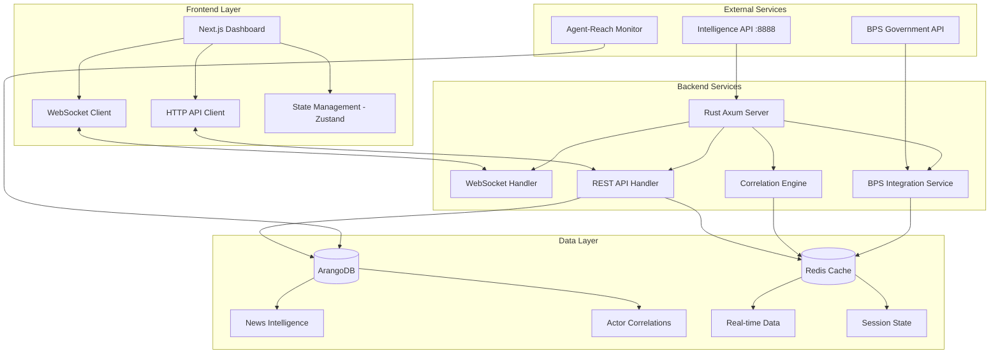

# Intelligence Dashboard Revamp - Technical Design
# Christian's Indonesian Portfolio Intelligence System

## 🏗️ **System Architecture Overview**



## 🔧 **Component Architecture**

### Frontend Components (Next.js + TypeScript)

#### Core Dashboard Components
```typescript
// Portfolio correlation matrix with real-time updates
interface CorrelationMatrixProps {
  stocks: StockSymbol[];
  correlationData: CorrelationMatrix;
  timeframe: '1D' | '7D' | '30D' | '90D';
  onTimeframeChange: (timeframe: string) => void;
}

// BPS economic indicators integration
interface EconomicIndicatorsProps {
  inflationData: BPSDataPoint[];
  portfolioImpact: PortfolioImpactAnalysis;
  updateFrequency: number; // seconds
}

// Prof Jiang framework visualization
interface GeopoliticalSignalsProps {
  jiangAnalysis: ProfJiangAnalysis;
  riskLevel: 'low' | 'medium' | 'high' | 'critical';
  confidenceScore: number;
  affectedAssets: StockSymbol[];
}

// Silent monitoring dashboard
interface MonitoringOverviewProps {
  systemHealth: SystemHealthMetrics;
  alertsMode: 'silent' | 'error-only' | 'verbose';
  criticalAlerts: Alert[];
}
```

#### State Management (Zustand)
```typescript
interface DashboardState {
  // Portfolio data
  portfolioData: {
    holdings: StockHolding[];
    correlationMatrix: CorrelationMatrix;
    riskMetrics: RiskMetrics;
  };
  
  // Real-time market data
  marketData: {
    prices: Record<StockSymbol, number>;
    lastUpdated: Date;
    connectionStatus: 'connected' | 'disconnected' | 'reconnecting';
  };
  
  // BPS economic data
  economicData: {
    indicators: BPSDataPoint[];
    portfolioImpact: PortfolioImpactAnalysis;
    collectionStatus: 'active' | 'rate-limited' | 'error';
  };
  
  // Intelligence system data
  intelligenceData: {
    profJiangAnalysis: ProfJiangAnalysis[];
    newsCorrelations: NewsCorrelation[];
    geopoliticalRisk: GeopoliticalRiskScore;
  };
  
  // System monitoring
  systemState: {
    alertsMode: AlertMode;
    notifications: Notification[];
    healthMetrics: SystemHealthMetrics;
  };
}
```

### Backend Architecture (Rust + Axum)

#### Core Service Structure
```rust
// Main application server
pub struct IntelligenceDashboardServer {
    db: Arc<ArangoConnection>,
    cache: Arc<RedisConnection>,
    bps_client: Arc<BPSClient>,
    intelligence_client: Arc<IntelligenceAPIClient>,
    websocket_hub: Arc<WebSocketHub>,
    correlation_engine: Arc<CorrelationEngine>,
}

// BPS integration service with rate limiting
pub struct BPSIntegrationService {
    client: reqwest::Client,
    rate_limiter: Arc<Mutex<RateLimiter>>,
    app_id: String,
    critical_variables: Vec<i32>,
    last_request_time: Arc<Mutex<Instant>>,
}

// Real-time correlation calculation engine
pub struct CorrelationEngine {
    price_buffer: Arc<RwLock<CircularBuffer<PriceUpdate>>>,
    correlation_cache: Arc<RwLock<HashMap<String, CorrelationMatrix>>>,
    update_frequency: Duration,
}

// WebSocket connection management
pub struct WebSocketHub {
    connections: Arc<RwLock<HashMap<String, WebSocketConnection>>>,
    broadcast_channel: broadcast::Sender<DashboardUpdate>,
}
```

#### Data Models
```rust
// Portfolio correlation data structures
#[derive(Debug, Serialize, Deserialize)]
pub struct StockHolding {
    pub symbol: StockSymbol,
    pub shares: u32,
    pub current_price: f64,
    pub market_value: f64,
    pub day_change: f64,
    pub day_change_percent: f64,
}

#[derive(Debug, Serialize, Deserialize)]
pub struct CorrelationMatrix {
    pub symbols: Vec<StockSymbol>,
    pub matrix: Vec<Vec<f64>>,
    pub timeframe: String,
    pub last_updated: DateTime<Utc>,
    pub confidence_interval: f64,
}

// BPS economic data integration
#[derive(Debug, Serialize, Deserialize)]
pub struct BPSDataPoint {
    pub var_id: i32,
    pub variable_name: String,
    pub category: String,
    pub value: Option<f64>,
    pub period: String,
    pub collection_time: DateTime<Utc>,
    pub data_quality: DataQuality,
}

// Prof Jiang framework analysis
#[derive(Debug, Serialize, Deserialize)]
pub struct ProfJiangAnalysis {
    pub framework_type: FrameworkType,
    pub analysis: String,
    pub prediction: String,
    pub confidence_score: f64,
    pub risk_level: RiskLevel,
    pub affected_assets: Vec<StockSymbol>,
    pub created: DateTime<Utc>,
}

// Silent monitoring system
#[derive(Debug, Serialize, Deserialize)]
pub struct SystemAlert {
    pub id: String,
    pub severity: AlertSeverity,
    pub category: AlertCategory,
    pub message: String,
    pub timestamp: DateTime<Utc>,
    pub acknowledged: bool,
    pub auto_resolved: bool,
}
```

## 📊 **Data Flow Architecture**

### Real-time Data Pipeline
```rust
// 1. Market data collection (every 30 seconds)
async fn collect_market_data(&self) -> Result<Vec<StockUpdate>> {
    let symbols = vec!["BMRI", "BBRI", "INCO", "ANTM", "PTBA", "TAPG"];
    let mut updates = Vec::new();
    
    for symbol in symbols {
        match self.fetch_stock_price(symbol).await {
            Ok(price_data) => updates.push(price_data),
            Err(e) => self.handle_collection_error(symbol, e).await,
        }
    }
    
    // Update correlation matrix
    self.correlation_engine.update(updates.clone()).await?;
    
    // Broadcast to WebSocket clients
    self.websocket_hub.broadcast(DashboardUpdate::MarketData(updates)).await?;
    
    Ok(updates)
}

// 2. BPS data collection (rate limited)
async fn collect_bps_data(&self) -> Result<Vec<BPSDataPoint>> {
    // Enforce 1.9 req/s rate limit
    self.bps_client.enforce_rate_limit().await;
    
    let critical_vars = vec![1, 2, 1709]; // Inflation indicators
    let mut data_points = Vec::new();
    
    for var_id in critical_vars {
        match self.bps_client.collect_variable(var_id).await {
            Ok(data_point) => {
                data_points.push(data_point);
                
                // Cache for offline resilience
                self.cache.set_bps_data(var_id, &data_point).await?;
            },
            Err(BPSError::RateLimit) => {
                warn!("BPS rate limit hit - using cached data");
                if let Some(cached) = self.cache.get_bps_data(var_id).await? {
                    data_points.push(cached);
                }
            },
            Err(e) => error!("BPS collection failed for var_id {}: {}", var_id, e),
        }
    }
    
    // Analyze portfolio impact
    let impact = self.analyze_portfolio_impact(&data_points).await?;
    
    // Broadcast updates
    self.websocket_hub.broadcast(DashboardUpdate::EconomicData {
        data_points: data_points.clone(),
        portfolio_impact: impact,
    }).await?;
    
    Ok(data_points)
}

// 3. Intelligence system integration
async fn sync_intelligence_data(&self) -> Result<IntelligenceUpdate> {
    // Fetch Prof Jiang analysis from localhost:8888
    let jiang_analysis = self.intelligence_client
        .get_prof_jiang_analysis()
        .await?;
    
    // Get news correlations
    let news_correlations = self.intelligence_client
        .get_news_correlations(&self.get_portfolio_symbols())
        .await?;
    
    // Calculate geopolitical risk score
    let geo_risk = self.calculate_geopolitical_risk(&jiang_analysis).await?;
    
    let update = IntelligenceUpdate {
        prof_jiang_analysis: jiang_analysis,
        news_correlations,
        geopolitical_risk: geo_risk,
        updated_at: Utc::now(),
    };
    
    // Broadcast to clients
    self.websocket_hub.broadcast(DashboardUpdate::Intelligence(update.clone())).await?;
    
    Ok(update)
}
```

### Correlation Analysis Engine
```rust
impl CorrelationEngine {
    // Real-time correlation matrix calculation
    pub async fn calculate_correlations(&self, timeframe: TimeFrame) -> Result<CorrelationMatrix> {
        let price_history = self.get_price_history(timeframe).await?;
        
        let symbols: Vec<StockSymbol> = price_history.keys().cloned().collect();
        let n = symbols.len();
        let mut matrix = vec![vec![0.0; n]; n];
        
        // Calculate Pearson correlation coefficients
        for (i, symbol_a) in symbols.iter().enumerate() {
            for (j, symbol_b) in symbols.iter().enumerate() {
                if i == j {
                    matrix[i][j] = 1.0;
                } else {
                    let prices_a = price_history.get(symbol_a).unwrap();
                    let prices_b = price_history.get(symbol_b).unwrap();
                    
                    matrix[i][j] = self.pearson_correlation(prices_a, prices_b)?;
                }
            }
        }
        
        Ok(CorrelationMatrix {
            symbols,
            matrix,
            timeframe: timeframe.to_string(),
            last_updated: Utc::now(),
            confidence_interval: self.calculate_confidence_interval(&matrix),
        })
    }
    
    // Detect correlation regime changes
    pub async fn detect_regime_changes(&self) -> Result<Vec<RegimeChange>> {
        let current_corr = self.calculate_correlations(TimeFrame::Daily).await?;
        let historical_corr = self.get_historical_correlations(30).await?;
        
        let mut regime_changes = Vec::new();
        
        for (i, symbol_a) in current_corr.symbols.iter().enumerate() {
            for (j, symbol_b) in current_corr.symbols.iter().enumerate() {
                if i < j {
                    let current_corr_value = current_corr.matrix[i][j];
                    let historical_avg = historical_corr.iter()
                        .map(|m| m.matrix[i][j])
                        .sum::<f64>() / historical_corr.len() as f64;
                    
                    let change = (current_corr_value - historical_avg).abs();
                    
                    if change > 0.3 { // Significant correlation change threshold
                        regime_changes.push(RegimeChange {
                            pair: (symbol_a.clone(), symbol_b.clone()),
                            old_correlation: historical_avg,
                            new_correlation: current_corr_value,
                            change_magnitude: change,
                            detected_at: Utc::now(),
                        });
                    }
                }
            }
        }
        
        Ok(regime_changes)
    }
}
```

## 🚨 **Silent Monitoring System Design**

### Error-Only Alert Architecture
```rust
pub enum AlertSeverity {
    Info,       // Filtered out in silent mode
    Warning,    // Filtered out in silent mode  
    Error,      // Shown in silent mode
    Critical,   // Always shown with immediate notification
}

pub enum AlertCategory {
    SystemHealth,
    DataCollection,
    PortfolioRisk,
    GeopoliticalEvent,
    APIConnectivity,
}

impl SilentMonitoringSystem {
    // Only trigger alerts for errors and critical events
    pub async fn evaluate_alert(&self, event: SystemEvent) -> Option<SystemAlert> {
        match event {
            // Silent: routine operations
            SystemEvent::DataCollectionSuccess(_) => None,
            SystemEvent::CorrelationUpdate(_) => None,
            SystemEvent::WebSocketConnection(_) => None,
            
            // Error alerts: system problems
            SystemEvent::BPSAPIFailure(error) => Some(SystemAlert {
                severity: AlertSeverity::Error,
                category: AlertCategory::APIConnectivity,
                message: format!("BPS API failure: {}", error),
                timestamp: Utc::now(),
                acknowledged: false,
                auto_resolved: false,
            }),
            
            // Critical alerts: portfolio risk
            SystemEvent::PortfolioDrawdown { percentage } if percentage > 5.0 => {
                Some(SystemAlert {
                    severity: AlertSeverity::Critical,
                    category: AlertCategory::PortfolioRisk,
                    message: format!("Critical portfolio drawdown: {:.1}%", percentage),
                    timestamp: Utc::now(),
                    acknowledged: false,
                    auto_resolved: false,
                })
            },
            
            // Critical alerts: correlation regime changes
            SystemEvent::CorrelationRegimeChange(change) => {
                Some(SystemAlert {
                    severity: AlertSeverity::Critical,
                    category: AlertCategory::PortfolioRisk,
                    message: format!(
                        "Correlation regime change: {}-{} from {:.2} to {:.2}",
                        change.pair.0, change.pair.1,
                        change.old_correlation, change.new_correlation
                    ),
                    timestamp: Utc::now(),
                    acknowledged: false,
                    auto_resolved: false,
                })
            },
            
            _ => None,
        }
    }
}
```

## 🧪 **Testing Strategy with Vibium Framework**

### Integration Test Structure
```typescript
// Vibium test configuration for financial data validation
export const vibiumConfig = {
  baseUrl: 'http://localhost:3000',
  testDataPath: './test-data',
  financialValidation: {
    correlationAccuracy: 0.95,
    priceDataTolerance: 0.01,
    bpsDataValidation: true,
    profJiangScoring: true,
  },
  testSuites: [
    'bps-integration',
    'correlation-engine',
    'websocket-connectivity',
    'portfolio-calculations',
    'prof-jiang-framework',
    'silent-monitoring',
  ],
};

// BPS API integration tests
describe('BPS Integration Tests', () => {
  test('Rate limiting compliance', async () => {
    const startTime = Date.now();
    const requests = [];
    
    // Test 10 requests
    for (let i = 0; i < 10; i++) {
      requests.push(bpsClient.collectVariable(1));
    }
    
    await Promise.all(requests);
    const endTime = Date.now();
    const duration = (endTime - startTime) / 1000;
    
    // Should take at least 10/1.9 = 5.26 seconds due to rate limiting
    expect(duration).toBeGreaterThan(5.0);
  });
  
  test('Portfolio impact calculation accuracy', async () => {
    const mockInflationData = [
      { var_id: 1, value: 3.5 }, // Higher inflation
      { var_id: 2, value: 3.2 },
    ];
    
    const impact = await portfolioAnalyzer.analyzePortfolioImpact(mockInflationData);
    
    // Banking sector should show high sensitivity to inflation
    expect(impact.Banking_Sector_Impact).toBeGreaterThan(70.0);
  });
});

// Correlation engine validation tests
describe('Correlation Engine Tests', () => {
  test('Matrix calculation accuracy', async () => {
    const testPriceData = await loadHistoricalPriceData();
    const correlationMatrix = await correlationEngine.calculateCorrelations(testPriceData);
    
    // Validate against known correlations
    const bmriBbriCorrelation = getCorrelation(correlationMatrix, 'BMRI', 'BBRI');
    expect(bmriBbriCorrelation).toBeCloseTo(0.75, 2); // Banking sector correlation
  });
  
  test('Regime change detection', async () => {
    const historicalData = await loadTestCorrelationData();
    const regimeChanges = await correlationEngine.detectRegimeChanges();
    
    // Should detect significant correlation shifts
    expect(regimeChanges.length).toBeGreaterThan(0);
    expect(regimeChanges[0].change_magnitude).toBeGreaterThan(0.3);
  });
});
```

## 📱 **Mobile Responsive Design**

### Responsive Layout Strategy
```typescript
// Breakpoint system for Indonesian portfolio dashboard
const breakpoints = {
  mobile: '320px',
  tablet: '768px', 
  desktop: '1024px',
  large: '1440px',
};

// Mobile-first component design
const PortfolioCorrelationMatrix: React.FC = () => {
  const [isMobile] = useMediaQuery('(max-width: 768px)');
  
  return (
    <div className="correlation-matrix-container">
      {isMobile ? (
        // Mobile: Simplified correlation cards
        <div className="grid grid-cols-1 gap-4">
          {correlationPairs.map(pair => (
            <CorrelationCard key={pair.id} {...pair} compact />
          ))}
        </div>
      ) : (
        // Desktop: Full matrix heatmap
        <div className="correlation-heatmap">
          <CorrelationHeatmap data={correlationMatrix} />
        </div>
      )}
    </div>
  );
};

// Touch-optimized controls for mobile trading
const MobilePortfolioControls: React.FC = () => (
  <div className="mobile-controls bg-gray-900 p-4 rounded-lg">
    <div className="grid grid-cols-2 gap-3">
      <Button 
        size="large"
        className="h-12 text-lg"
        onClick={refreshPortfolio}
      >
        🔄 Refresh
      </Button>
      <Button 
        size="large" 
        className="h-12 text-lg"
        type="primary"
        onClick={viewAlerts}
      >
        🚨 Alerts
      </Button>
    </div>
    
    <div className="mt-4 grid grid-cols-3 gap-2">
      {['1D', '7D', '30D'].map(timeframe => (
        <Button 
          key={timeframe}
          size="small"
          className="h-10"
          type={selectedTimeframe === timeframe ? 'primary' : 'default'}
          onClick={() => setTimeframe(timeframe)}
        >
          {timeframe}
        </Button>
      ))}
    </div>
  </div>
);
```

## 🔒 **Security & Data Privacy**

### Security Architecture
```rust
// API request validation and sanitization
pub async fn validate_request(req: Request<Body>) -> Result<ValidatedRequest, SecurityError> {
    // Rate limiting per IP
    if !rate_limiter.check_request(&get_client_ip(&req)).await? {
        return Err(SecurityError::RateLimitExceeded);
    }
    
    // Input validation
    let validated_body = validate_json_schema(&req.body(), &API_SCHEMA)?;
    
    // CORS validation for dashboard requests
    if !validate_cors_origin(&req.headers()) {
        return Err(SecurityError::InvalidOrigin);
    }
    
    Ok(ValidatedRequest {
        body: validated_body,
        headers: req.headers().clone(),
        client_ip: get_client_ip(&req),
    })
}

// Data privacy for financial information
pub fn sanitize_financial_data(data: &mut FinancialData, user_role: UserRole) {
    match user_role {
        UserRole::Owner => {
            // Christian sees all data
        },
        UserRole::Viewer => {
            // Hide absolute portfolio values, show only percentages
            data.portfolio_value = None;
            data.individual_holdings = None;
        },
        UserRole::Guest => {
            // Only aggregated market data
            data.portfolio_data = None;
            data.personal_alerts = None;
        }
    }
}

// Secure configuration management
#[derive(Deserialize)]
pub struct SecureConfig {
    #[serde(deserialize_with = "deserialize_secret")]
    pub bps_app_id: Secret<String>,
    
    #[serde(deserialize_with = "deserialize_secret")]
    pub arangodb_password: Secret<String>,
    
    #[serde(deserialize_with = "deserialize_secret")]
    pub redis_password: Option<Secret<String>>,
    
    pub allowed_origins: Vec<String>,
    pub api_rate_limits: RateLimitConfig,
    pub session_timeout: u64,
}
```

---

## 🚀 **Deployment Architecture**

### Docker Compose Configuration
```yaml
# docker-compose.yml for intelligence dashboard
version: '3.8'
services:
  dashboard-backend:
    build: 
      context: ./backend
      dockerfile: Dockerfile
    environment:
      - RUST_LOG=info
      - BPS_APP_ID=${BPS_APP_ID}
      - ARANGODB_URL=http://arangodb:8529
      - REDIS_URL=redis://redis:6379
      - INTELLIGENCE_API_URL=http://host.docker.internal:8888
    ports:
      - "8080:8080"
    depends_on:
      - redis
      - arangodb
    restart: unless-stopped
    
  dashboard-frontend:
    build:
      context: ./frontend
      dockerfile: Dockerfile
    environment:
      - NEXT_PUBLIC_API_URL=http://localhost:8080
      - NEXT_PUBLIC_WS_URL=ws://localhost:8080
    ports:
      - "3000:3000"
    depends_on:
      - dashboard-backend
    restart: unless-stopped
    
  redis:
    image: redis:7-alpine
    ports:
      - "6379:6379"
    command: redis-server --appendonly yes
    volumes:
      - redis_data:/data
    restart: unless-stopped
    
  arangodb:
    image: arangodb:3.10
    environment:
      - ARANGO_ROOT_PASSWORD=${ARANGO_PASSWORD}
    ports:
      - "8529:8529"
    volumes:
      - arango_data:/var/lib/arangodb3
      - arango_apps:/var/lib/arangodb3-apps
    restart: unless-stopped

volumes:
  redis_data:
  arango_data:
  arango_apps:
```

### Monitoring & Observability
```rust
// Prometheus metrics collection
pub fn setup_metrics() -> PrometheusRegistry {
    let registry = PrometheusRegistry::new();
    
    // System health metrics
    let system_health = IntGaugeVec::new(
        Opts::new("system_health", "System component health status"),
        &["component"]
    ).unwrap();
    
    // API performance metrics
    let api_response_time = HistogramVec::new(
        HistogramOpts::new("api_response_time", "API response time in seconds"),
        &["endpoint", "method"]
    ).unwrap();
    
    // BPS API metrics
    let bps_requests = CounterVec::new(
        Opts::new("bps_requests_total", "Total BPS API requests"),
        &["status", "variable"]
    ).unwrap();
    
    // Portfolio metrics
    let portfolio_value = Gauge::new(
        "portfolio_total_value", 
        "Total portfolio value in IDR"
    ).unwrap();
    
    let correlation_updates = Counter::new(
        "correlation_matrix_updates_total",
        "Total correlation matrix updates"
    ).unwrap();
    
    registry.register(Box::new(system_health)).unwrap();
    registry.register(Box::new(api_response_time)).unwrap();
    registry.register(Box::new(bps_requests)).unwrap();
    registry.register(Box::new(portfolio_value)).unwrap();
    registry.register(Box::new(correlation_updates)).unwrap();
    
    registry
}

// Health check endpoint for monitoring
pub async fn health_check() -> Result<impl Reply, Rejection> {
    let mut health_status = HashMap::new();
    
    // Check ArangoDB connection
    health_status.insert("arangodb", check_arangodb_health().await);
    
    // Check Redis connection  
    health_status.insert("redis", check_redis_health().await);
    
    // Check BPS API connectivity
    health_status.insert("bps_api", check_bps_api_health().await);
    
    // Check Intelligence API
    health_status.insert("intelligence_api", check_intelligence_api_health().await);
    
    let overall_healthy = health_status.values().all(|&status| status);
    
    let response = json!({
        "status": if overall_healthy { "healthy" } else { "degraded" },
        "components": health_status,
        "timestamp": Utc::now(),
        "version": env!("CARGO_PKG_VERSION")
    });
    
    Ok(reply::json(&response))
}
```

This technical design provides the comprehensive architecture needed for Christian's intelligence dashboard revamp, integrating all the specified requirements while maintaining compatibility with existing systems and ensuring scalability for future enhancements.