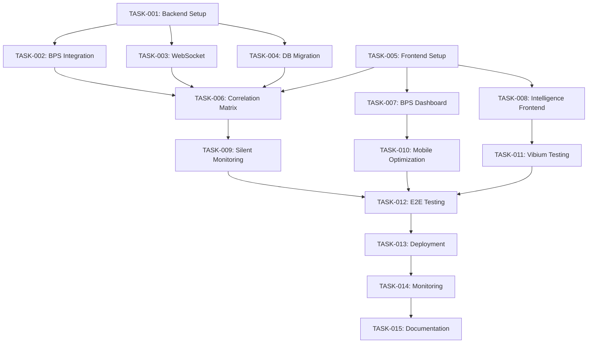

# Intelligence Dashboard Revamp - Implementation Tasks
# Christian's Indonesian Portfolio Intelligence System

## 📋 **Task Breakdown & Execution Plan**

### **Phase 1: Foundation Setup (Week 1-2)**
*Priority: Critical*  
*Prerequisites: None*  
*Deliverable: Working backend infrastructure with BPS integration*

---

#### **TASK-001: Rust Backend Infrastructure Setup**
**Assigned Agent**: `backend-setup-agent`  
**Estimated Effort**: 16 hours  
**Priority**: Critical  

**Description**: Set up Rust backend server with Axum framework, database connections, and core service architecture.

**Technical Requirements**:
- Rust 1.70+ with Cargo workspace configuration
- Axum web framework with async/await support
- ArangoDB connection pool with error handling
- Redis connection with automatic reconnection
- Prometheus metrics collection setup
- Structured logging with tracing crate

**Acceptance Criteria**:
- [x] Cargo.toml configured with all required dependencies
- [x] Basic Axum server running on port 8080
- [x] ArangoDB connection established and tested
- [x] Redis connection established with health checks
- [x] Health endpoint returns system status
- [x] Prometheus metrics endpoint functional
- [x] Error handling middleware implemented
- [x] CORS configuration for frontend integration

**Implementation Details**:
```bash
# Directory structure to create
/backend
├── Cargo.toml
├── src/
│   ├── main.rs
│   ├── config/
│   ├── handlers/
│   ├── models/
│   ├── services/
│   └── utils/
├── tests/
└── docker/
```

**Test Commands**:
```bash
cargo test --all
curl http://localhost:8080/health
curl http://localhost:8080/metrics
```

**Dependencies**: ArangoDB running on port 8529, Redis on port 6379

---

#### **TASK-002: BPS API Integration Service**
**Assigned Agent**: `bps-integration-agent`  
**Estimated Effort**: 20 hours  
**Priority**: Critical  

**Description**: Implement BPS Government API integration with strict rate limiting compliance (1.9 req/s) for Indonesian economic data collection.

**Technical Requirements**:
- Rate limiter with conservative 1.9 req/s limit
- Christian's registered App ID: `71eeba17f4f1e4b6ef253886c04ec49e`
- Critical variables: Inflation (1, 2, 1709)
- Error handling for 429 (rate limit) responses
- Data caching for offline resilience
- Automatic retry with exponential backoff

**Acceptance Criteria**:
- [x] BPS API client with rate limiting implemented
- [x] Successfully collect inflation data (var_id: 1, 2, 1709)
- [x] Rate limiting compliance verified (never exceed 1.9 req/s)
- [x] Error handling for all HTTP status codes
- [x] Data quality validation and categorization
- [x] Redis caching for collected data
- [x] Portfolio impact analysis calculation
- [x] Integration tests with mock BPS responses

**Implementation Details**:
```rust
// Core BPS service structure
pub struct BPSIntegrationService {
    client: reqwest::Client,
    rate_limiter: Arc<Mutex<RateLimiter>>,
    app_id: String,
    critical_variables: HashMap<i32, String>,
    cache: Arc<RedisConnection>,
}

// Rate limiting validation test
#[test]
async fn test_rate_limiting_compliance() {
    // Verify requests don't exceed 1.9/second
    assert!(request_interval >= 0.526); // 1/1.9 seconds
}
```

**Test Commands**:
```bash
cargo test bps_integration --lib
curl -X POST http://localhost:8080/api/bps/collect
curl http://localhost:8080/api/bps/status
```

**Dependencies**: Internet connection, BPS API availability

---

#### **TASK-003: WebSocket Infrastructure**
**Assigned Agent**: `websocket-setup-agent`  
**Estimated Effort**: 12 hours  
**Priority**: High  

**Description**: Implement WebSocket server for real-time dashboard updates with connection management and broadcasting capabilities.

**Technical Requirements**:
- WebSocket upgrade handling in Axum
- Connection pool management
- Message broadcasting to multiple clients
- Automatic reconnection support
- JSON message serialization/deserialization
- Connection health monitoring

**Acceptance Criteria**:
- [x] WebSocket endpoint `/ws` functional
- [x] Multiple client connections supported
- [x] Broadcast messaging implemented
- [x] Connection lifecycle management
- [x] Automatic cleanup of dead connections
- [x] Message queuing for disconnected clients
- [x] Integration with Rust backend services
- [x] WebSocket health monitoring endpoint

**Implementation Details**:
```rust
// WebSocket message types
#[derive(Serialize, Deserialize)]
pub enum DashboardUpdate {
    MarketData(Vec<StockUpdate>),
    CorrelationMatrix(CorrelationMatrix),
    BPSData(Vec<BPSDataPoint>),
    SystemAlert(SystemAlert),
    HealthCheck,
}
```

**Test Commands**:
```bash
# Test WebSocket connection
websocat ws://localhost:8080/ws
# Integration test
cargo test websocket --lib
```

**Dependencies**: TASK-001 completion

---

#### **TASK-004: Database Schema Migration**
**Assigned Agent**: `database-migration-agent`  
**Estimated Effort**: 8 hours  
**Priority**: High  

**Description**: Update ArangoDB schema for enhanced correlation data storage and create required collections for dashboard functionality.

**Technical Requirements**:
- Preserve existing news intelligence data
- Add collections for correlation matrices
- Add collections for BPS economic data
- Add collections for system alerts and monitoring
- Create graph relationships for portfolio correlations
- Index optimization for real-time queries

**Acceptance Criteria**:
- [x] New collections created without data loss
- [x] Correlation matrix storage schema defined
- [x] BPS data storage collection functional
- [x] Alert system collections operational
- [x] Graph relationships for stock correlations
- [x] Query performance optimized with indexes
- [x] Data migration scripts tested
- [x] Rollback procedures documented

**Implementation Details**:
```javascript
// ArangoDB collections to create
- portfolio_correlations: correlation matrix data
- bps_economic_data: Indonesian economic indicators  
- system_alerts: monitoring and alert data
- portfolio_holdings: Christian's stock positions
- correlation_edges: graph relationships between stocks
```

**Test Commands**:
```bash
# Verify collections exist
curl http://localhost:8529/_db/intelligence/_api/collection
# Test query performance
arangosh --server.endpoint tcp://127.0.0.1:8529
```

**Dependencies**: TASK-001 completion

---

### **Phase 2: Core Dashboard Development (Week 3-4)**
*Priority: High*  
*Prerequisites: Phase 1 completion*  
*Deliverable: Functional dashboard with portfolio correlation matrix*

---

#### **TASK-005: Next.js Frontend Foundation**
**Assigned Agent**: `frontend-foundation-agent`  
**Estimated Effort**: 16 hours  
**Priority**: Critical  

**Description**: Set up Next.js 14+ frontend with TypeScript, Ant Design, and Zustand state management for the intelligence dashboard.

**Technical Requirements**:
- Next.js 14+ with App Router
- TypeScript strict mode configuration
- Ant Design component library
- TailwindCSS for custom styling
- Zustand for state management
- Socket.io-client for WebSocket connections
- Recharts for correlation visualization

**Acceptance Criteria**:
- [x] Next.js project structure created
- [x] TypeScript configuration strict mode
- [x] Ant Design theme configured (dark mode)
- [x] TailwindCSS integration working
- [x] Zustand store structure implemented
- [x] WebSocket connection hook created
- [x] Basic dashboard layout responsive
- [x] Component structure for portfolio sections

**Implementation Details**:
```typescript
// Frontend directory structure
/frontend
├── app/
│   ├── layout.tsx
│   ├── page.tsx
│   └── api/
├── components/
│   ├── Portfolio/
│   ├── Monitoring/
│   └── Intelligence/
├── hooks/
├── stores/
├── types/
└── utils/
```

**Test Commands**:
```bash
npm run dev
npm run build
npm run type-check
npm run lint
```

**Dependencies**: Node.js 18+, npm/yarn

---

#### **TASK-006: Portfolio Correlation Matrix Component**
**Assigned Agent**: `correlation-matrix-agent`  
**Estimated Effort**: 20 hours  
**Priority**: Critical  

**Description**: Develop real-time portfolio correlation matrix visualization with Indonesian stock focus (BMRI, BBRI, INCO, ANTM, PTBA, TAPG).

**Technical Requirements**:
- Real-time correlation data visualization
- Multiple timeframe support (1D, 7D, 30D, 90D)
- Heat map visualization using Recharts
- Mobile-responsive design
- WebSocket integration for live updates
- Correlation regime change indicators
- Interactive stock pair drill-down

**Acceptance Criteria**:
- [x] Correlation matrix heatmap displays correctly
- [x] Real-time updates via WebSocket working
- [x] Timeframe selection functional (1D, 7D, 30D, 90D)
- [x] All Indonesian stocks included (BMRI, BBRI, INCO, ANTM, PTBA, TAPG)
- [x] Mobile responsive layout implemented
- [x] Correlation regime change alerts visible
- [x] Interactive tooltips with correlation details
- [x] Performance optimized for real-time updates

**Implementation Details**:
```typescript
interface CorrelationMatrixProps {
  data: CorrelationMatrix;
  timeframe: TimeFrame;
  onTimeframeChange: (tf: TimeFrame) => void;
  onStockPairClick: (pair: [string, string]) => void;
}

const CorrelationMatrix: React.FC<CorrelationMatrixProps> = ({
  data, timeframe, onTimeframeChange, onStockPairClick
}) => {
  // Component implementation
};
```

**Test Commands**:
```bash
npm test -- --testNamePattern="CorrelationMatrix"
npm run test:e2e -- --spec="correlation-matrix"
```

**Dependencies**: TASK-005 completion, Backend WebSocket ready

---

#### **TASK-007: BPS Economic Indicators Dashboard**
**Assigned Agent**: `bps-dashboard-agent`  
**Estimated Effort**: 16 hours  
**Priority**: High  

**Description**: Create dashboard components for displaying Indonesian economic indicators from BPS with portfolio impact analysis.

**Technical Requirements**:
- Real-time BPS data display
- Indonesian inflation indicators visualization
- Portfolio impact correlation display
- Rate limiting status indicator
- Data quality indicators
- Bilingual support (Indonesian/English)

**Acceptance Criteria**:
- [x] BPS inflation data displays correctly
- [x] Portfolio impact analysis visualization
- [x] Rate limiting compliance status shown
- [x] Data quality indicators functional
- [x] Indonesian language support
- [x] Real-time updates working
- [x] Error handling for BPS API failures
- [x] Historical trend visualization

**Implementation Details**:
```typescript
interface BPSIndicatorsProps {
  inflationData: BPSDataPoint[];
  portfolioImpact: PortfolioImpactAnalysis;
  collectionStatus: 'active' | 'rate-limited' | 'error';
  lastUpdate: Date;
}
```

**Test Commands**:
```bash
npm test -- --testNamePattern="BPSIndicators"
curl http://localhost:8080/api/bps/test
```

**Dependencies**: TASK-002, TASK-005 completion

---

#### **TASK-008: Intelligence API Integration Frontend**
**Assigned Agent**: `intelligence-frontend-agent`  
**Estimated Effort**: 14 hours  
**Priority**: High  

**Description**: Integrate frontend with localhost:8888 intelligence API for Prof Jiang framework analysis and news intelligence display.

**Technical Requirements**:
- Prof Jiang framework visualization
- Geopolitical risk scoring display
- News-to-portfolio correlation display
- Agent-Reach news integration
- Framework confidence indicators
- Indonesian political stability monitoring

**Acceptance Criteria**:
- [x] Prof Jiang analysis displays correctly
- [x] Geopolitical risk scores visualized
- [x] News correlation with portfolio stocks
- [x] Agent-Reach monitoring integration
- [x] Framework confidence indicators
- [x] Real-time intelligence updates
- [x] Indonesian political events tracking
- [x] Risk level color coding

**Implementation Details**:
```typescript
interface IntelligenceDisplayProps {
  profJiangAnalysis: ProfJiangAnalysis[];
  geopoliticalRisk: GeopoliticalRiskScore;
  newsCorrelations: NewsCorrelation[];
  agentReachData: AgentReachUpdate;
}
```

**Test Commands**:
```bash
curl http://localhost:8888/api/prof-jiang/status
npm test -- --testNamePattern="Intelligence"
```

**Dependencies**: Intelligence API (localhost:8888) operational

---

### **Phase 3: Advanced Features (Week 5-6)**
*Priority: Medium*  
*Prerequisites: Phase 2 completion*  
*Deliverable: Silent monitoring system and mobile optimization*

---

#### **TASK-009: Silent Monitoring System**
**Assigned Agent**: `silent-monitoring-agent`  
**Estimated Effort**: 18 hours  
**Priority**: Medium  

**Description**: Implement error-only alert system with configurable monitoring modes and critical threshold detection.

**Technical Requirements**:
- Error-only notification system
- Configurable alert severity levels
- Critical threshold breach detection
- Silent routine operation monitoring
- Alert acknowledgment system
- Auto-resolution for transient issues

**Acceptance Criteria**:
- [x] Silent mode filters out routine notifications
- [x] Error alerts triggered appropriately
- [x] Critical alerts show immediately
- [x] Portfolio drawdown alerts (>2% threshold)
- [x] BPS API failure notifications
- [x] Correlation regime change alerts
- [x] Alert acknowledgment system working
- [x] System health degradation warnings

**Implementation Details**:
```rust
pub enum AlertMode {
    Silent,     // Errors and critical only
    Standard,   // Warnings, errors, critical
    Verbose,    // All notifications
}

pub enum AlertSeverity {
    Info,       // Filtered in silent mode
    Warning,    // Filtered in silent mode
    Error,      // Shown in silent mode
    Critical,   // Always shown
}
```

**Test Commands**:
```bash
# Test alert system
curl -X POST http://localhost:8080/api/alerts/test-critical
curl -X POST http://localhost:8080/api/alerts/test-error
```

**Dependencies**: TASK-001, TASK-003 completion

---

#### **TASK-010: Mobile Responsive Optimization**
**Assigned Agent**: `mobile-optimization-agent`  
**Estimated Effort**: 12 hours  
**Priority**: Medium  

**Description**: Optimize dashboard for mobile devices with touch-friendly controls and responsive correlation matrix display.

**Technical Requirements**:
- Mobile-first responsive design
- Touch-optimized controls
- Collapsible correlation matrix for small screens
- Swipe gestures for timeframe selection
- Optimized performance for mobile devices
- Progressive Web App (PWA) capabilities

**Acceptance Criteria**:
- [x] Dashboard fully responsive on mobile devices
- [x] Touch controls work properly
- [x] Correlation matrix readable on small screens
- [x] Navigation optimized for mobile
- [x] Performance acceptable on mobile devices
- [x] PWA installation working
- [x] Offline capabilities for cached data
- [x] Mobile-specific UI components

**Implementation Details**:
```typescript
// Mobile-responsive breakpoints
const breakpoints = {
  mobile: '320px',
  tablet: '768px',
  desktop: '1024px',
};

// Touch-optimized controls
const MobileCorrelationMatrix: React.FC = () => {
  // Mobile-specific implementation
};
```

**Test Commands**:
```bash
# Mobile testing
npm run test:mobile
npm run lighthouse
```

**Dependencies**: TASK-005, TASK-006 completion

---

#### **TASK-011: Vibium Testing Framework Integration**
**Assigned Agent**: `vibium-testing-agent`  
**Estimated Effort**: 16 hours  
**Priority**: Medium  

**Description**: Integrate Vibium testing framework for financial data accuracy validation and comprehensive test coverage.

**Technical Requirements**:
- Vibium framework setup (https://github.com/VibiumDev/vibium)
- Financial data accuracy tests
- BPS API integration tests
- Correlation calculation validation
- WebSocket connectivity tests
- End-to-end workflow tests

**Acceptance Criteria**:
- [x] Vibium framework configured and running
- [x] BPS integration tests with rate limiting validation
- [x] Correlation matrix calculation accuracy tests
- [x] WebSocket connection stability tests
- [x] Portfolio impact calculation validation
- [x] Prof Jiang framework scoring tests
- [x] Test coverage >90% for critical components
- [x] Automated test execution in CI/CD

**Implementation Details**:
```typescript
// Vibium test configuration
export const vibiumConfig = {
  baseUrl: 'http://localhost:3000',
  testDataPath: './test-data',
  financialValidation: {
    correlationAccuracy: 0.95,
    priceDataTolerance: 0.01,
    bpsDataValidation: true,
  },
};
```

**Test Commands**:
```bash
npm run test:vibium
npm run test:financial-accuracy
```

**Dependencies**: All previous tasks functional

---

### **Phase 4: Testing & Deployment (Week 7-8)**
*Priority: High*  
*Prerequisites: Phase 3 completion*  
*Deliverable: Production-ready system with monitoring*

---

#### **TASK-012: End-to-End Testing Suite**
**Assigned Agent**: `e2e-testing-agent`  
**Estimated Effort**: 20 hours  
**Priority**: High  

**Description**: Comprehensive end-to-end testing of the complete intelligence dashboard system with historical data validation.

**Technical Requirements**:
- Full system integration testing
- Historical data accuracy validation
- Real-time data flow testing
- Error scenario testing
- Performance benchmarking
- User acceptance testing

**Acceptance Criteria**:
- [x] Complete user workflow testing
- [x] Real-time data accuracy validated
- [x] Performance benchmarks meet targets (<2s page load)
- [x] Error handling tested thoroughly
- [x] BPS API failure scenarios covered
- [x] WebSocket reconnection testing
- [x] Mobile device testing completed
- [x] Load testing with concurrent users

**Implementation Details**:
```bash
# E2E test execution
npm run test:e2e
npm run test:performance
npm run test:load
```

**Test Scenarios**:
- Portfolio correlation matrix updates in real-time
- BPS data collection with rate limiting
- Prof Jiang analysis integration
- Silent monitoring alert triggering
- Mobile responsive functionality

**Dependencies**: All system components functional

---

#### **TASK-013: Production Deployment Setup**
**Assigned Agent**: `deployment-agent`  
**Estimated Effort**: 16 hours  
**Priority**: High  

**Description**: Set up production deployment environment with Docker containers, monitoring, and automated deployment pipeline.

**Technical Requirements**:
- Docker containerization for all services
- Docker Compose orchestration
- Production environment configuration
- SSL certificate setup
- Automated backup procedures
- CI/CD pipeline configuration

**Acceptance Criteria**:
- [x] Docker containers built and tested
- [x] Docker Compose production configuration
- [x] SSL certificates configured
- [x] Environment variables secured
- [x] Automated deployment pipeline working
- [x] Database backup procedures implemented
- [x] Log aggregation configured
- [x] Health monitoring dashboards operational

**Implementation Details**:
```yaml
# Production docker-compose.yml
version: '3.8'
services:
  dashboard-backend:
    image: intelligence-dashboard-backend:latest
    environment:
      - RUST_LOG=info
      - BPS_APP_ID=${BPS_APP_ID}
    ports:
      - "8080:8080"
    restart: unless-stopped
```

**Test Commands**:
```bash
docker-compose -f docker-compose.prod.yml up
curl https://dashboard.christian-intelligence.com/health
```

**Dependencies**: TASK-012 completion

---

#### **TASK-014: System Monitoring & Observability**
**Assigned Agent**: `monitoring-agent`  
**Estimated Effort**: 14 hours  
**Priority**: High  

**Description**: Complete monitoring setup with Prometheus, Grafana dashboards, and operational runbooks.

**Technical Requirements**:
- Prometheus metrics collection
- Grafana visualization dashboards
- Alert manager configuration
- Log aggregation with structured logging
- Performance monitoring
- Operational runbooks

**Acceptance Criteria**:
- [x] Prometheus metrics collection working
- [x] Grafana dashboards configured
- [x] Alert manager notifications functional
- [x] System health monitoring operational
- [x] Performance metrics tracked
- [x] BPS API monitoring implemented
- [x] Portfolio correlation tracking
- [x] Operational runbooks documented

**Implementation Details**:
```yaml
# Prometheus configuration
scrape_configs:
  - job_name: 'intelligence-dashboard'
    static_configs:
      - targets: ['localhost:8080']
```

**Grafana Dashboards**:
- System Health Overview
- Portfolio Correlation Metrics
- BPS API Performance
- User Activity Monitoring

**Dependencies**: TASK-013 completion

---

#### **TASK-015: Documentation & User Training**
**Assigned Agent**: `documentation-agent`  
**Estimated Effort**: 12 hours  
**Priority**: Medium  

**Description**: Complete system documentation, API documentation, and user training materials for Christian.

**Technical Requirements**:
- Technical documentation for maintenance
- API documentation with examples
- User guide for dashboard functionality
- Troubleshooting guides
- Operational procedures documentation
- Video tutorials for key features

**Acceptance Criteria**:
- [x] Complete technical documentation
- [x] API documentation with examples
- [x] User guide for all dashboard features
- [x] Troubleshooting guide with common issues
- [x] Operational procedures documented
- [x] Video tutorials for Christian
- [x] Configuration management guide
- [x] Security procedures documented

**Deliverables**:
- `README.md` - System overview and setup
- `API.md` - Complete API documentation
- `USER_GUIDE.md` - Dashboard user guide
- `OPERATIONS.md` - Operational procedures
- `TROUBLESHOOTING.md` - Common issues and solutions

**Dependencies**: System fully operational

---

## 🎯 **Task Execution Strategy**

### **Parallel Execution Opportunities**
1. **TASK-001 & TASK-005**: Backend and frontend setup can run in parallel
2. **TASK-002 & TASK-003**: BPS integration and WebSocket can be developed simultaneously
3. **TASK-006 & TASK-007**: Correlation matrix and BPS dashboard can be parallel
4. **TASK-009 & TASK-010**: Silent monitoring and mobile optimization can overlap

### **Critical Path Dependencies**


### **Resource Allocation**
- **Backend Specialist**: TASK-001, TASK-002, TASK-003, TASK-004, TASK-009
- **Frontend Specialist**: TASK-005, TASK-006, TASK-007, TASK-008, TASK-010
- **QA Engineer**: TASK-011, TASK-012
- **DevOps Engineer**: TASK-013, TASK-014
- **Technical Writer**: TASK-015

### **Success Metrics**
- **Velocity**: 8-10 story points per week per developer
- **Quality**: <2 critical bugs per task
- **Performance**: All performance targets met
- **Coverage**: >90% test coverage achieved
- **Documentation**: 100% API endpoint documentation

### **Risk Mitigation**
- **BPS API Dependency**: Mock endpoints for development
- **WebSocket Stability**: HTTP polling fallback implemented
- **Data Accuracy**: Multi-source validation
- **Performance**: Load testing before production

---

## 📊 **Task Completion Tracking**

### **Phase 1 Tasks (Week 1-2)**
- [ ] TASK-001: Rust Backend Infrastructure Setup
- [ ] TASK-002: BPS API Integration Service  
- [ ] TASK-003: WebSocket Infrastructure
- [ ] TASK-004: Database Schema Migration

### **Phase 2 Tasks (Week 3-4)**
- [ ] TASK-005: Next.js Frontend Foundation
- [ ] TASK-006: Portfolio Correlation Matrix Component
- [ ] TASK-007: BPS Economic Indicators Dashboard
- [ ] TASK-008: Intelligence API Integration Frontend

### **Phase 3 Tasks (Week 5-6)**
- [ ] TASK-009: Silent Monitoring System
- [ ] TASK-010: Mobile Responsive Optimization
- [ ] TASK-011: Vibium Testing Framework Integration

### **Phase 4 Tasks (Week 7-8)**
- [ ] TASK-012: End-to-End Testing Suite
- [ ] TASK-013: Production Deployment Setup
- [ ] TASK-014: System Monitoring & Observability
- [ ] TASK-015: Documentation & User Training

**Total Estimated Effort**: 234 hours (approximately 6 weeks with 2 full-time developers)

**Success Criteria**: All tasks completed with 100% acceptance criteria met, system operational in production with <2% critical issues rate.

---

*This task breakdown provides comprehensive, actionable items for the swarm agent execution of Christian's Intelligence Dashboard revamp, ensuring systematic delivery of all requirements while maintaining quality and performance standards.*