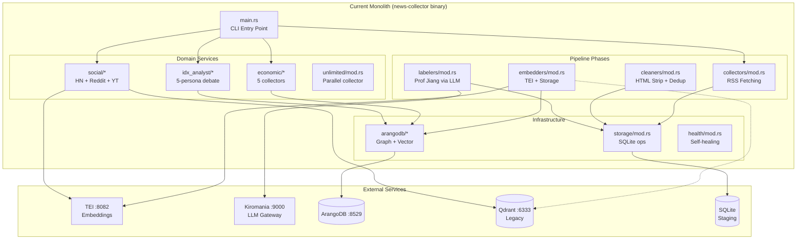
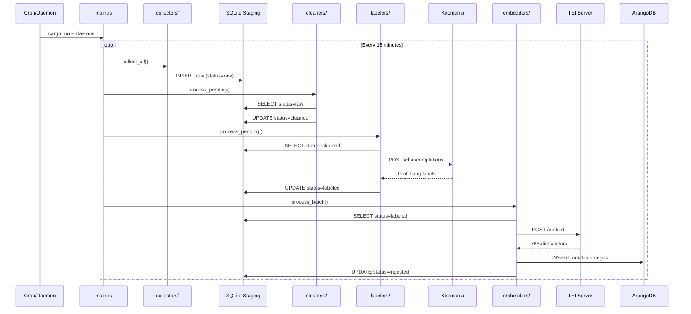
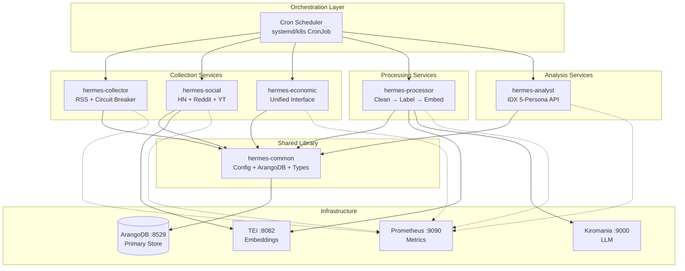
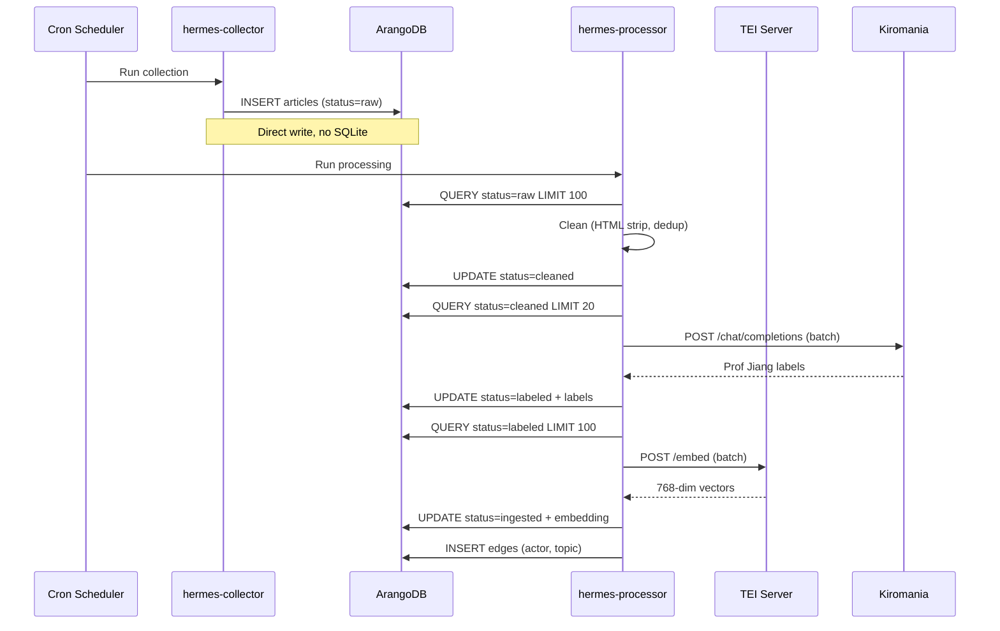

# Pipeline Re-Architecture Design

## Overview

This design document describes the technical architecture for decomposing the Hermes Data Pipeline monolith into focused, independently deployable services. The re-architecture follows a gradual migration strategy that maintains backward compatibility while enabling incremental improvements.

**Design Principles:**
1. **Strangler Fig Pattern**: Incrementally replace monolith functionality with services
2. **Shared-Nothing Architecture**: Services own their data and communicate via APIs
3. **Event-Driven Where Beneficial**: Use queues for async processing, direct calls for sync
4. **Fail Fast, Recover Gracefully**: Circuit breakers and retries throughout

## Architecture

The re-architecture transforms a monolithic Rust binary into a Cargo workspace with 6 service crates sharing a common library. Services communicate via ArangoDB as the shared data store.

**Key Decisions:**
1. Cargo Workspace for shared compilation
2. ArangoDB as shared state store
3. Stateless services for horizontal scaling
4. CLI plus HTTP hybrid interfaces
5. Direct database access without staging

## Current Architecture Analysis

### Monolith Component Map



### Current Data Flow




### Pain Points Identified

| Component | Pain Point | Impact | Root Cause |
|-----------|------------|--------|------------|
| Pipeline | Single binary, slow rebuild | Dev velocity | Monolith structure |
| SQLite Staging | 4 writes per article | I/O bottleneck | Intermediate storage |
| social_intel/ | Duplicate Python code | Maintenance | Gradual migration incomplete |
| idx_analyst/ | Tightly coupled | Cannot deploy separately | Same binary |
| economic/ | Inconsistent interfaces | Hard to extend | Organic growth |
| Config | Scattered env vars | Deployment errors | No central schema |
| Observability | Logs only | Blind spots | Not instrumented |

## Proposed Architecture

### Target Service Topology




### Target Data Flow (Direct ArangoDB)



### Workspace Structure

```
hermes-data-pipeline/
├── Cargo.toml                    # Workspace root
├── crates/
│   ├── hermes-common/            # Shared library
│   │   ├── Cargo.toml
│   │   └── src/
│   │       ├── lib.rs
│   │       ├── config.rs         # Centralized config
│   │       ├── arangodb/         # ArangoDB client
│   │       ├── types/            # Shared domain types
│   │       └── observability/    # Logging, metrics
│   │
│   ├── hermes-collector/         # News collection service
│   │   ├── Cargo.toml
│   │   └── src/
│   │       ├── main.rs           # CLI entry
│   │       ├── feeds.rs          # Feed config
│   │       ├── collector.rs      # RSS fetching
│   │       └── circuit.rs        # Circuit breaker

│   │
│   ├── hermes-processor/         # Processing pipeline
│   │   ├── Cargo.toml
│   │   └── src/
│   │       ├── main.rs
│   │       ├── cleaner.rs
│   │       ├── labeler.rs
│   │       └── embedder.rs
│   │
│   ├── hermes-social/            # Social intelligence
│   │   ├── Cargo.toml
│   │   └── src/
│   │       ├── main.rs
│   │       ├── hackernews.rs
│   │       ├── reddit.rs
│   │       └── youtube.rs
│   │
│   ├── hermes-economic/          # Economic data
│   │   ├── Cargo.toml
│   │   └── src/
│   │       ├── main.rs
│   │       ├── collector.rs      # Unified interface
│   │       ├── yahoo.rs
│   │       ├── coingecko.rs
│   │       ├── fred.rs
│   │       └── bank_indonesia.rs
│   │
│   └── hermes-analyst/           # IDX Analyst API
│       ├── Cargo.toml
│       └── src/
│           ├── main.rs           # HTTP server
│           ├── api.rs            # REST endpoints
│           ├── debate.rs
│           ├── trader.rs
│           └── formatter.rs
│
├── infrastructure/
│   ├── docker-compose.yml
│   └── .env.canonical            # Single source of truth
│
└── legacy/                       # Deprecated code
    └── social_intel/             # Python (to remove)
```

## Components and Interfaces

### hermes-common (Shared Library)

The foundation crate providing shared functionality across all services.

**Responsibilities:**
- Centralized configuration loading and validation
- ArangoDB client with connection pooling
- Shared domain types (Article, Actor, Topic, Signal)
- Observability primitives (logging, metrics, tracing)
- Health check utilities


**Key Exports:**

| Module | Export | Description |
|--------|--------|-------------|
| `config` | `HermesConfig` | Unified config struct from env vars |
| `arangodb` | `ArangoClient` | HTTP client with connection pooling |
| `types` | `Article`, `Actor`, `Topic` | Domain models |
| `types` | `ArticleStatus`, `Signal` | Status and signal enums |
| `observability` | `init_logging()` | Structured logging setup |
| `observability` | `MetricsRegistry` | Prometheus metrics |

### hermes-collector (News Collection Service)

Standalone service for RSS feed collection with circuit breaker pattern.

**Responsibilities:**
- Fetch RSS feeds from 31 configured sources
- Circuit breaker for feed health management
- Direct ArangoDB storage (bypass SQLite staging)
- Prometheus metrics for collection stats

**CLI Commands:**

| Command | Description |
|---------|-------------|
| `collect` | One-shot collection of all feeds |
| `daemon` | Run collection every 15 minutes |
| `health` | Report feed health status |
| `prune --days N` | Remove articles older than N days |

### hermes-processor (Processing Pipeline)

Processing service executing clean → label → embed phases.

**Responsibilities:**
- Retrieve unprocessed articles from ArangoDB
- Clean phase: HTML strip, normalize, SHA256 dedup
- Label phase: Prof Jiang via LLM API (batched)
- Embed phase: TEI embeddings + graph edge creation

**CLI Commands:**

| Command | Description |
|---------|-------------|
| `run` | Process all pending articles |
| `run --phase clean` | Run single phase only |
| `run --limit 100` | Process up to N articles |
| `daemon` | Continuous processing loop |


### hermes-social (Social Intelligence Service)

Consolidated Rust implementation of social media collection.

**Responsibilities:**
- HackerNews collection via Algolia API
- Reddit collection via RSS/Atom feeds
- YouTube metadata collection
- 768-dim TEI embeddings (unified with news)
- Near-duplicate detection across sources

**CLI Commands:**

| Command | Description |
|---------|-------------|
| `collect --topics "AI,tech"` | Collect by topic |
| `collect --front-page` | Collect front page posts |
| `collect --depth quick` | Quick collection (fewer items) |
| `daemon` | Run collection every 2 hours |

**Deprecates:** Python `social_intel/` module (44 Rust tests cover same functionality)


### hermes-economic (Economic Data Service)

Unified economic data collector with consistent interface.

**Responsibilities:**
- Yahoo Finance commodities (11 symbols)
- CoinGecko crypto (BTC, ETH, USDT, BNB, XRP)
- FRED macro indicators (6 series)
- Bank Indonesia rates (BI Rate, JIBOR, USD/IDR)
- Rate limiting per-source configuration

**CLI Commands:**

| Command | Description |
|---------|-------------|
| `collect all` | Collect from all sources |
| `collect commodity` | Yahoo commodities only |
| `collect crypto` | CoinGecko only |
| `collect fred` | FRED macro data only |
| `collect bi` | Bank Indonesia only |
| `daemon` | Run collection every hour |


### hermes-analyst (IDX Analyst API Service)

HTTP API service for stock analysis using 5-persona debate engine.

**Responsibilities:**
- REST API for stock analysis requests
- 5-persona bull/bear debate engine
- Trade proposal generation (entry/stop/target)
- Portfolio constraint validation
- Multiple output formats (JSON, RTI, Telegram)

**API Endpoints:**

| Endpoint | Method | Description |
|----------|--------|-------------|
| `/api/v1/analyze/{ticker}` | GET | Single ticker analysis |
| `/api/v1/portfolio` | GET | Full portfolio analysis |
| `/api/v1/digest` | GET | Daily digest |
| `/api/v1/signals/{ticker}` | GET | External signals |
| `/health/live` | GET | Liveness probe |
| `/health/ready` | GET | Readiness probe |


## Data Models

### Core Domain Models

#### Article (articles collection)

| Field | Type | Description |
|-------|------|-------------|
| `_key` | string | Document key (SHA256 hash) |
| `title` | string | Article title |
| `content` | string | Cleaned article content |
| `url` | string | Source URL |
| `source` | string | Feed name |
| `published_at` | datetime | Publication timestamp |
| `collected_at` | datetime | Collection timestamp |
| `status` | enum | raw, cleaned, labeled, ingested |
| `labels` | object | Prof Jiang analysis (nullable) |
| `embedding` | float[768] | TEI vector (nullable) |


#### EconomicIndicator (economic_indicators collection)

| Field | Type | Description |
|-------|------|-------------|
| `_key` | string | source_indicator_timestamp |
| `source` | string | yahoo, coingecko, fred, bi |
| `indicator` | string | GOLD, BTC, GDP, BI_RATE |
| `value` | float | Indicator value |
| `unit` | string | USD, IDR, percent |
| `change_pct` | float | Percentage change |
| `timestamp` | datetime | Data timestamp |


### Graph Relationships (Edge Collections)

| Edge Collection | From → To | Attributes |
|-----------------|-----------|------------|
| `article_mentions_actor` | articles → actors | weight, sentiment |
| `article_has_topic` | articles → topics | relevance |
| `actor_relates_actor` | actors → actors | relation_type |
| `signal_source` | signals → articles | strength, direction |
| `article_similar` | articles → articles | similarity_score |


## Data Flow Comparison

### Before: Monolith with SQLite Staging

Total writes per article: 4 SQLite + 1 ArangoDB = 5 writes

### After: Services with Direct ArangoDB

Total writes per article: 1 INSERT + 3 UPDATES = 4 writes (all ArangoDB)

**Benefits:**
- Eliminates SQLite intermediate store
- Reduces write amplification
- Simplifies recovery (single source of truth)
- Enables AQL queries during processing


## Migration Strategy

### Phase 1: Extract hermes-common (Week 1)

**Goal:** Create shared library without changing monolith behavior.

1. Create `crates/hermes-common/` workspace member
2. Move `src/arangodb/` to shared library
3. Extract config and types from `src/lib.rs`
4. Update monolith to depend on hermes-common
5. Verify all existing tests pass

### Phase 2: Extract hermes-collector (Week 2)

**Goal:** Standalone collection with direct ArangoDB writes.

1. Create `crates/hermes-collector/` workspace member
2. Modify to write directly to ArangoDB (bypass SQLite)
3. Add Prometheus metrics endpoint
4. Verify collection writes to ArangoDB articles collection


### Phase 3: Extract hermes-processor (Week 3)

**Goal:** Processing service reading from ArangoDB.

1. Create `crates/hermes-processor/`
2. Query ArangoDB by status for each phase
3. Update status after phase completion
4. Verify labels and embeddings stored correctly


### Phase 4: SQLite Migration (Week 4)

1. Write migration script for pending items
2. Run migration on production  
3. Verify data integrity
4. Remove SQLite dependencies

### Phase 5: Extract hermes-social (Week 5)

1. Create `crates/hermes-social/`
2. Update to 768-dim TEI embeddings
3. Write to ArangoDB social_posts
4. Deprecate Python social_intel cron

### Phase 6: Extract hermes-economic (Week 6)

1. Create `crates/hermes-economic/`
2. Implement unified collector trait
3. Add per-source rate limiting
4. Add Prometheus metrics per source


### Phase 7: Extract hermes-analyst (Week 7-8)

1. Create `crates/hermes-analyst/`
2. Add HTTP server (axum)
3. Implement REST API endpoints
4. Add external signal injection
5. Add health check endpoints

### Phase 8: Observability (Week 9-10)

1. Add structured JSON logging
2. Add Prometheus metrics
3. Add Grafana dashboards
4. Update documentation


## Error Handling

### Service-Level Strategy

| Error Type | Strategy |
|------------|----------|
| Network timeout | Retry with backoff |
| API rate limit | Respect and retry |
| Parse error | Skip item, continue |
| LLM error | Circuit breaker |
| Database error | Fail fast, alert |
| Config error | Fail at startup |

### Graceful Degradation

| Component Failure | Behavior |
|-------------------|----------|
| TEI unavailable | Skip embedding |
| LLM unavailable | Skip labeling |
| ArangoDB unavailable | Queue locally |
| Single feed dead | Skip, continue others |


## Testing Strategy

### Unit Testing

Each service targets 70 percent unit test coverage:

| Service | Test Focus |
|---------|------------|
| hermes-common | Config parsing, ArangoDB mocking |
| hermes-collector | Feed parsing, circuit breaker |
| hermes-processor | HTML cleaning, dedup hash |
| hermes-social | Platform-specific parsing |
| hermes-economic | API parsing, rate limiting |
| hermes-analyst | Debate logic, signals |

### Integration Testing

- ArangoDB CRUD against real instance
- AQL graph traversal queries
- Vector similarity search
- Service status transitions


### End-to-End Testing

1. Start all services plus infrastructure
2. Inject test RSS feed
3. Verify article flows through all phases
4. Query ArangoDB for final state
5. Verify metrics incremented


## Glossary

| Term | Definition |
|------|------------|
| Monolith | Current single Rust binary |
| Service | Independently deployable unit |
| hermes-common | Shared library crate |
| Circuit Breaker | Skip failing feeds temporarily |
| Prof Jiang | Game theory news analysis |
| TEI | Text Embeddings Inference |
| Kiromania | LLM gateway for labeling |
| AQL | ArangoDB Query Language |
| Intelligence Graph | Graph connecting articles to actors |
| ExternalSignal | Economic data for IDX Analyst |
| Strangler Fig | Incremental replacement pattern |

## Correctness Properties

Property 1: Status Transitions

_For any_ article entering the processing pipeline, its status SHALL follow the sequence: raw → cleaned → labeled → ingested. No phase SHALL be skipped. If labeling fails, article remains at "cleaned" status. If embedding fails, article remains at "labeled" status.

**Validates: Requirements 1.2**

Property 2: Data Integrity

_For any_ article collected, there SHALL be exactly one document in ArangoDB `articles` collection with SHA256 content hash as `_key`. Duplicate content submissions SHALL be rejected via ArangoDB key constraint.

**Validates: Requirements 3.1, 5.2**

Property 3: Service Independence

_For any_ service failure (hermes-collector, hermes-processor, hermes-social, hermes-economic, hermes-analyst), all other services SHALL continue operating without interruption. No shared process or memory between services.

**Validates: Requirements 5.1**

Property 4: Idempotency

_For any_ collection or processing operation, running the same operation multiple times SHALL produce the same final state. Re-collecting the same RSS feed SHALL not create duplicate articles. Re-processing the same article SHALL not corrupt data.

**Validates: Requirements 5.2**

Property 5: Config Consistency

_For all_ services in the workspace, environment variables SHALL be read via `hermes-common::config::HermesConfig` struct. No service SHALL define its own configuration schema or read env vars directly.

**Validates: Requirements 2.1**
