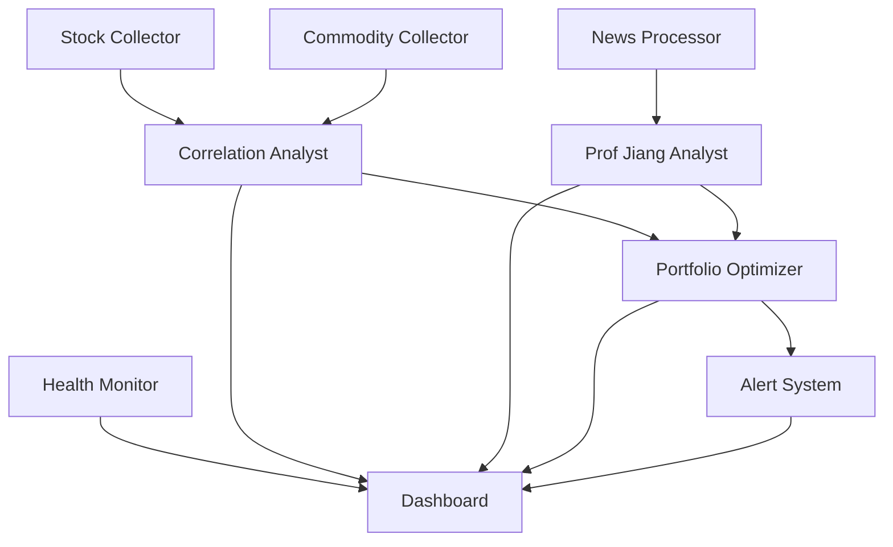

# Agent Swarm Specification for Hermes Data Pipeline Enhancement

## 🎯 **Overview**
Multi-agent system untuk enhance Indonesian financial intelligence pipeline dengan specialized agents yang berkolaborasi untuk data collection, analysis, dan decision making.

## 🏗️ **Architecture Design**

### **Core Principles**
- **Specialization**: Each agent fokus pada domain expertise tertentu
- **Autonomy**: Agents operate independently dengan defined objectives  
- **Coordination**: Structured communication dan dependency management
- **Resilience**: Fault tolerance dengan agent redundancy dan failover
- **Indonesian Focus**: Specialized untuk BMRI, BBRI, INCO, ANTM + commodities

---

## 🤖 **Agent Roles & Specifications**

### **1. Market Data Collection Swarm**

#### **1.1 Indonesian Stock Agent** 
**Role**: Real-time Indonesian stock data collection
**Targets**: BMRI, BBRI, INCO, ANTM + IDX top 50
**Data Sources**: 
- Yahoo Finance Indonesia API
- Jakarta Stock Exchange feeds
- Bloomberg Indonesia
- Local brokers APIs (Mandiri Sekuritas, BCA Sekuritas)

**Capabilities**:
```yaml
agent_id: indonesian_stock_collector
schedule: "every 30 seconds during market hours"
fallback_schedule: "every 5 minutes off-hours"
data_points:
  - real_time_price
  - volume
  - market_cap  
  - price_changes
  - sector_rotation
  - foreign_vs_local_buying
error_handling:
  - automatic retry with exponential backoff
  - switch to backup data sources
  - alert portfolio manager on failures
output_format: "standardized_stock_data"
```

#### **1.2 Commodity Intelligence Agent**
**Role**: Strategic commodities tracking untuk Indonesian exports
**Targets**: Nickel (INCO), Gold (ANTM), Coal (PTBA), Palm Oil (TAPG)
**Data Sources**:
- London Metal Exchange (LME)  
- Chicago Mercantile Exchange (CME)
- Indonesian Commodity Exchange
- Global commodity news feeds

**Capabilities**:
```yaml
agent_id: commodity_intelligence_collector  
schedule: "every 1 minute"
specialization:
  nickel_analysis:
    - LME prices dengan Indonesian correlation
    - Supply chain disruption signals
    - Chinese demand patterns
  coal_monitoring:
    - Newcastle futures
    - Indonesian export quotas
    - Environmental regulations impact
  palm_oil_tracking:
    - Malaysian benchmarks
    - Indonesian production forecasts
    - Sustainability compliance trends
correlation_engine: "real_time_commodity_stock_correlation"
```

#### **1.3 News Intelligence Agent**
**Role**: Multi-source Indonesian financial news aggregation + analysis
**Sources**: Kompas, Detik, Tempo, CNN Indonesia, Bloomberg Indonesia, Reuters Indonesia

**Capabilities**:
```yaml
agent_id: news_intelligence_processor
schedule: "every 2 minutes"
processing_pipeline:
  - multilingual_extraction: "Indonesian + English"
  - sentiment_analysis: "stock_specific_sentiment" 
  - entity_recognition: "companies, regulations, people"
  - impact_scoring: "market_moving_probability"
prof_jiang_integration:
  - geopolitical_risk_scoring
  - elite_overproduction_indicators
  - institutional_capture_signals
output: "structured_news_correlations"
```

### **2. Analysis & Intelligence Swarm**

#### **2.1 Prof Jiang Geopolitical Agent**
**Role**: Geopolitical risk analysis menggunakan Prof Jiang framework
**Specialization**: Elite overproduction theory applied ke Indonesian markets

**Capabilities**:
```yaml
agent_id: prof_jiang_geopolitical_analyst
framework: "elite_overproduction_theory"
analysis_dimensions:
  political_fragmentation:
    - Coalition stability analysis
    - Regional autonomy tensions  
    - Elite competition patterns
  institutional_capture:
    - Banking sector regulatory capture
    - Mining license corruption indicators
    - Infrastructure project irregularities
  resource_nationalism:
    - Export restriction probabilities
    - Foreign investment policy shifts
    - Strategic mineral control patterns
output_frequency: "every 15 minutes"
confidence_scoring: "bayesian_confidence_intervals"
```

#### **2.2 Correlation Matrix Agent** 
**Role**: Advanced correlation analysis untuk portfolio risk management
**Focus**: Cross-asset, cross-sector, dan temporal correlation patterns

**Capabilities**:
```yaml
agent_id: correlation_matrix_analyst
analysis_types:
  static_correlation:
    - pearson_correlation_matrix
    - spearman_rank_correlation  
    - kendall_tau_correlation
  dynamic_correlation:
    - rolling_window_correlation (30D, 90D, 1Y)
    - regime_change_detection
    - volatility_clustering_analysis
  market_microstructure:
    - intraday_correlation_patterns  
    - volume_weighted_correlations
    - liquidity_adjusted_correlations
risk_metrics:
  - portfolio_concentration_risk
  - tail_dependence_analysis
  - copula_based_risk_measures
```

#### **2.3 Portfolio Optimization Agent**
**Role**: Real-time portfolio rebalancing recommendations
**Method**: Modern Portfolio Theory + Indonesian market constraints

**Capabilities**:
```yaml
agent_id: portfolio_optimization_engine
optimization_objectives:
  - risk_adjusted_returns: "sharpe_ratio_maximization"
  - drawdown_minimization: "maximum_drawdown_constraints"  
  - indonesian_focus: "minimum_70_percent_indonesian_exposure"
constraints:
  regulatory_compliance:
    - foreign_ownership_limits
    - sector_concentration_limits
    - liquidity_requirements
  market_microstructure:
    - transaction_cost_modeling
    - market_impact_estimation
    - optimal_execution_timing
rebalancing_triggers:
  - correlation_regime_changes
  - geopolitical_risk_spikes
  - liquidity_stress_indicators
```

### **3. Monitoring & Alert Swarm**

#### **3.1 System Health Agent**
**Role**: Infrastructure monitoring dan performance optimization
**Scope**: Backend services, database, API endpoints, data pipeline health

**Capabilities**:
```yaml
agent_id: system_health_monitor
monitoring_targets:
  backend_services:
    - rust_backend_performance
    - database_query_performance  
    - api_response_times
    - memory_usage_patterns
  data_pipeline_health:
    - data_freshness_monitoring
    - collection_failure_detection
    - data_quality_validation
    - anomaly_detection
alerting_system:
  - real_time_slack_notifications
  - telegram_urgent_alerts
  - email_daily_summaries
auto_remediation:
  - service_restart_on_failure
  - database_connection_recovery
  - cache_clearing_on_staleness
```

#### **3.2 Market Alert Agent**
**Role**: Critical market event detection dan immediate notification
**Triggers**: Price movements, news events, correlation breaks

**Capabilities**:
```yaml
agent_id: market_alert_system
alert_categories:
  price_movements:
    - single_stock_circuit_breaker
    - portfolio_drawdown_thresholds  
    - unusual_volume_spikes
  correlation_breaks:
    - correlation_regime_changes
    - tail_dependence_violations
    - liquidity_stress_indicators
  geopolitical_events:
    - prof_jiang_instability_signals
    - regulatory_announcement_impact
    - foreign_policy_market_implications
notification_channels:
  - telegram_instant_alerts
  - dashboard_popup_notifications
  - mobile_push_notifications
escalation_procedures:
  - severity_based_routing
  - time_based_escalation
  - manual_acknowledgment_requirements
```

---

## 🔄 **Agent Coordination Patterns**

### **Communication Architecture**
```yaml
communication_pattern: "event_driven_messaging"
message_broker: "redis_streams"
message_formats: "structured_json_schemas"
routing_patterns:
  - publish_subscribe: "data_updates, alerts"
  - request_response: "analysis_requests, health_checks"  
  - event_sourcing: "audit_trail, decision_history"
```

### **Dependency Management**
```yaml
dependency_graph:
  tier_1_collectors:
    - indonesian_stock_collector
    - commodity_intelligence_collector
    - news_intelligence_processor
  tier_2_analysts:
    depends_on: [tier_1_collectors]
    agents:
      - prof_jiang_geopolitical_analyst
      - correlation_matrix_analyst
  tier_3_decision_makers:
    depends_on: [tier_1_collectors, tier_2_analysts]
    agents:
      - portfolio_optimization_engine
      - market_alert_system
  tier_4_monitors:
    depends_on: [all_tiers]
    agents:
      - system_health_monitor
```

### **Data Flow Pipeline**


---

## 📊 **Implementation Strategy**

### **Phase 1: Core Collection Swarm (Week 1-2)**
```yaml
priority: "high"
agents_to_deploy:
  - indonesian_stock_collector
  - commodity_intelligence_collector  
  - system_health_monitor
success_metrics:
  - 99.5% data collection uptime
  - <100ms average API response
  - Real-time BMRI/BBRI/INCO/ANTM data
infrastructure_requirements:
  - redis_streams_setup
  - agent_orchestration_framework
  - monitoring_dashboard_v1
```

### **Phase 2: Intelligence Analysis Swarm (Week 3-4)** 
```yaml
priority: "medium"
agents_to_deploy:
  - news_intelligence_processor
  - prof_jiang_geopolitical_analyst
  - correlation_matrix_analyst
success_metrics:
  - Geopolitical risk scoring accuracy >80%
  - News sentiment correlation with price moves
  - Real-time correlation matrix updates
integration_points:
  - prof_jiang_framework_integration
  - multilingual_news_processing  
  - advanced_statistical_models
```

### **Phase 3: Decision & Alert Swarm (Week 5-6)**
```yaml
priority: "medium"
agents_to_deploy:
  - portfolio_optimization_engine
  - market_alert_system
success_metrics:
  - Portfolio optimization recommendations
  - <30 second alert latency
  - 95% alert relevance accuracy
advanced_features:
  - real_time_rebalancing_suggestions
  - multi_channel_alert_system
  - decision_audit_trail
```

---

## 🚀 **Technical Implementation**

### **Agent Framework**
```yaml
base_framework: "hermes_delegation_system"
agent_runtime: "python_asyncio + rust_performance_critical"
message_passing: "redis_streams"
state_management: "arangodb_document_store"
monitoring: "prometheus + grafana"
```

### **Deployment Architecture**
```yaml
containerization: "docker_compose"
orchestration: "kubernetes_optional"
scaling_strategy: "horizontal_agent_scaling"
resource_allocation:
  - cpu_intensive_agents: "correlation_analysis, optimization"
  - memory_intensive_agents: "news_processing, data_collection"
  - io_intensive_agents: "database_agents, api_collectors"
```

### **Data Schemas**
```yaml
standardized_formats:
  stock_data: "indonesian_stock_schema_v1"
  commodity_data: "strategic_commodity_schema_v1"  
  news_data: "multilingual_news_schema_v1"
  geopolitical_signals: "prof_jiang_framework_schema_v1"
  correlation_matrices: "multi_timeframe_correlation_schema_v1"
  portfolio_recommendations: "optimization_recommendation_schema_v1"
```

---

## 📈 **Success Metrics & KPIs**

### **Operational Excellence**
- **System Uptime**: >99.5%
- **Data Freshness**: <30 seconds lag
- **Alert Accuracy**: >95% relevance
- **API Performance**: <100ms p95 latency

### **Intelligence Quality**  
- **Prof Jiang Risk Scoring**: Correlation with actual market volatility >0.7
- **News Sentiment**: Correlation with next-day price movements >0.6
- **Portfolio Optimization**: Sharpe ratio improvement >20%
- **Correlation Accuracy**: Matrix updates reflect regime changes

### **Indonesian Market Focus**
- **Stock Coverage**: 100% uptime untuk BMRI, BBRI, INCO, ANTM
- **Commodity Correlation**: Real-time nickel/coal prices vs stock performance
- **Local News Impact**: Indonesian news sentiment leading indicators
- **Regulatory Monitoring**: 100% coverage major Indonesian financial regulations

---

## 🔧 **Configuration Files**

### **Agent Deployment Config**
```yaml
# /config/agent_swarm.yaml
swarm_configuration:
  deployment_environment: "production"
  coordination_backend: "redis://localhost:6379"
  data_backend: "arangodb://localhost:8529/intelligence"
  
  agents:
    indonesian_stock_collector:
      enabled: true
      schedule: "*/30 * * * * *"  # Every 30 seconds
      resources:
        cpu_limit: "0.5"
        memory_limit: "512Mi"
      data_sources:
        - "yahoo_finance_indonesia"
        - "idx_realtime_feed" 
        - "bloomberg_indonesia"
      
    prof_jiang_geopolitical_analyst:
      enabled: true
      schedule: "0 */15 * * * *"  # Every 15 minutes
      resources:
        cpu_limit: "1.0"
        memory_limit: "1Gi"
      analysis_parameters:
        confidence_threshold: 0.7
        elite_overproduction_weight: 0.4
        institutional_capture_weight: 0.3
        resource_nationalism_weight: 0.3
```

### **Message Schema Registry**
```json
{
  "schemas": {
    "indonesian_stock_update": {
      "type": "object",
      "properties": {
        "symbol": {"type": "string", "enum": ["BMRI", "BBRI", "INCO", "ANTM"]},
        "price": {"type": "number", "minimum": 0},
        "volume": {"type": "integer", "minimum": 0},
        "timestamp": {"type": "string", "format": "date-time"},
        "market_cap_idr": {"type": "number"},
        "foreign_ownership_pct": {"type": "number", "maximum": 100}
      },
      "required": ["symbol", "price", "volume", "timestamp"]
    },
    "prof_jiang_signal": {
      "type": "object", 
      "properties": {
        "signal_type": {"type": "string", "enum": ["elite_overproduction", "institutional_capture", "resource_nationalism"]},
        "risk_level": {"type": "string", "enum": ["low", "medium", "high", "critical"]},
        "confidence_score": {"type": "number", "minimum": 0, "maximum": 1},
        "affected_assets": {"type": "array", "items": {"type": "string"}},
        "analysis_summary": {"type": "string"},
        "timestamp": {"type": "string", "format": "date-time"}
      }
    }
  }
}
```

---

## 🎯 **Next Steps untuk Implementation**

1. **Setup Agent Orchestration Framework**
   - Deploy Redis Streams untuk message passing
   - Create base agent classes dengan standardized interfaces
   - Implement agent lifecycle management

2. **Develop Phase 1 Agents**  
   - Indonesian stock collector dengan multi-source failover
   - System health monitor dengan comprehensive metrics
   - Basic correlation analyst untuk proof-of-concept

3. **Integration dengan Existing Pipeline**
   - Migrate current Rust backend to agent coordinator role
   - Enhance ArangoDB schema untuk agent state management
   - Update Next.js dashboard untuk multi-agent data visualization

4. **Testing & Validation**
   - End-to-end testing dengan Indonesian market data
   - Prof Jiang framework validation dengan historical events
   - Performance benchmarking vs current single-agent system

**Target Timeline**: 6 weeks untuk full swarm deployment
**Resource Requirements**: 4-6 CPU cores, 16GB RAM, redundant network connections
**Success Criteria**: 10x improvement dalam data freshness, analysis depth, dan decision quality

---

*Agent swarm ini akan transform hermes-data-pipeline dari single-threaded system jadi sophisticated multi-agent intelligence network yang specialized untuk Indonesian financial markets dengan Prof Jiang geopolitical framework integration.*